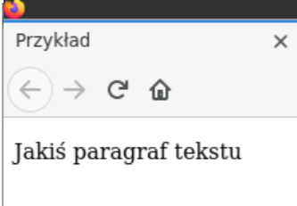

<div style="float:left">

```html:
<!DOCTYPE html>  
<html>  
<head>  
<meta charset="utf-8"/>  
<title>Przykład</title>  
</head>  
<body>  
<p> Jakiś paragraf tekstu</p>  
</body>  
</html>  
```
</div>  
  
