# Lekcja 1 – Markdown lekki język znaczników

## Spis treści

Lekcja 1 – Markdown lekki język znaczników....................................................................................1  
Wstęp...............................................................................................................................................1  
Podstawy składni.............................................................................................................................3  
Definiowanie nagłówków...........................................................................................................3  
Definiowanie list.........................................................................................................................4  
Wyróżnianie tekstu......................................................................................................................4  
Tabele..........................................................................................................................................5  
Odnośniki do zasobów................................................................................................................ 5  
Obrazki........................................................................................................................................5  
Kod źródłowy dla różnych języków programowania.................................................................5  
Tworzenie spisu treści na podstawie nagłówków.......................................................................6  
Edytory dedykowane.......................................................................................................................7  
Pandoc – system do konwersji dokumentów Markdown do innych formatów...............................8  
Lekcja 2 – Git – system kontroli wersji................................................................................................9  
Git - podstawowe cechy...................................................................................................................9  
Idea pracy:........................................................................................................................................9  
Git – tworzenie pustego archiwum lokalnego...............................................................................11  
Zadania do wykonania na punkty.......................................................................................................21  
Zadanie 1 – 2pkt............................................................................................................................21  
Zadanie 2 – 4pkt............................................................................................................................21  
Zadanie 3 - 4pkt.............................................................................................................................21  

## Wstęp

Obecnie powszechnie wykorzystuje się języki ze znacznikami do opisania dodatkowych informacji
umieszczanych w plikach tekstowych. Z pośród najbardziej popularnych można wspomnieć o:

1. **html** – służącym do opisu struktury informacji zawartych na stronach internetowych,  

2. **Tex** (Latex) – poznany na zajęciach język do „profesjonalnego” składania tekstów,  

3. **XML** ( _Extensible Markup Language)_ - uniwersalnym języku znaczników przeznaczonym do
    reprezentowania różnych danych w ustrukturalizowany sposób.

Przykład kodu html i jego interpretacja w przeglądarce:  

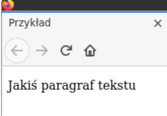

<\!DOCTYPE **html**>  
<**html**>  
<**head**>  
<**meta** charset="utf-8" />  
\<title>Przykład\</title>  
</**head**>  
<**body**>  
<**p**> Jakiś paragraf tekstu</**p**>  
</**body**>  
</**html**>  

Przykład kodu Latex i wygenerowanego pliku w formacie pdf:  

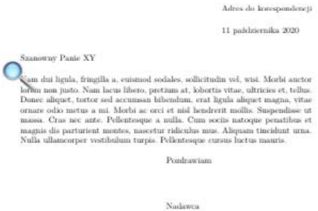

\\documentclass[]{letter}  
\\usepackage{lipsum}  
\\usepackage{polyglossia}  
\\setmainlanguage{polish}  
\\**begin**{**document**}  
\\**begin**{**letter** }{**Szanowny Panie XY** }  
\\address{Adres do korespondencji}  
\\opening{}  
\\lipsum[2]  
\\signature{Nadawca}  
\\closing{Pozdrawiam}  
\\**end** {**letter**}  
\\**end** {**document**}  

Przykład kodu XML – fragment dokumentu SVG (Scalar Vector Graphics)  

<\!DOCTYPE **html**>  
<**html**>  
<**body**>  
\<svg height="100" width="100">  
 \<circle cx="50" cy="50" r="40" stroke="black" stroke-width="3" fill="red" />  
\</svg>  
</**body**>  
</**html**>  

W tym przypadku mamy np. znacznik np. \<circle> opisujący parametry koła i który może być
właściwie zinterpretowany przez dedykowaną aplikację (np. przeglądarki www).

Jako ciekawostkę można podać fakt, że również pakiet MS Office wykorzystuje format XML do
przechowywania informacji o dodatkowych parametrach formatowania danych. Na przykład pliki z
rozszerzeniem _docx_ , to nic innego jak spakowane algorytmem zip katalogi z plikami xml.

$unzip -l **test** .docx  
Archive: **test** .docx  
Length **Date Time** Name  
\--------- ---------- ----- ----  
573 2020-10-11 18:20 _rels **/** .rels  
731 2020-10-11 18:20 docProps **/** core.xml  
508 2020-10-11 18:20 docProps **/** app.xml  
531 2020-10-11 18:20 word **/** _rels **/** document.xml.rels  
1421 2020-10-11 18:20 word **/** document.xml  
2429 2020-10-11 18:20 word **/** styles.xml  
853 2020-10-11 18:20 word **/** fontTable.xml  
241 2020-10-11 18:20 word **/** settings.xml  
1374 2020-10-11 18:20 **[** Content_Types **]** .xml  

Wszystkie te języki znaczników cechują się rozbudowaną i złożoną składnią i dlatego do ich edycji
wymagają najczęściej dedykowanych narzędzi w postaci specjalizowanych edytorów. By
wyeliminować powyższą niedogodność powstał **Markdown** - uproszczony język znaczników
służący do formatowania dokumentów tekstowych (bez konieczności używania specjalizowanych
narzędzi). Dokumenty w tym formacie można bardzo łatwo konwertować do wielu innych
formatów: np. html, pdf, ps (postscript), epub, xml i wiele innych. Format ten jest powszechnie
używany do tworzenia plików README.md (w projektach open source) i powszechnie
obsługiwany przez serwery git’a. Język ten został stworzony w 2004 r. a jego twórcami byli John
Gruber i Aaron Swartz. W kolejnych latach podjęto prace w celu stworzenia standardu rozwiązania
i tak w 2016 r. opublikowano dokument <ins>RFC 7764</ins> który zawiera opis kilku odmian tegoż języka:

- CommonMark,
- GitHub Flavored Markdown (GFM),
- Markdown Extra.

## Podstawy składni

Podany link: <ins>https://github.com/adam-p/markdown-here/wiki/Markdown-Cheatsheet </ins>zawiera opis
podstawowych elementów składni w języku angielskim. Poniżej zostanie przedstawiony ich krótki
opis w języku polskim.

### Definiowanie nagłówków

W tym celu używamy znaku kratki

Lewe okno zawiera kod źródłowy – prawe -podgląd przetworzonego tekstu

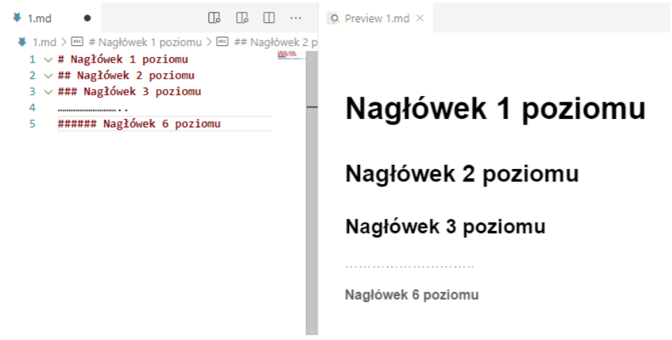  

### Definiowanie list

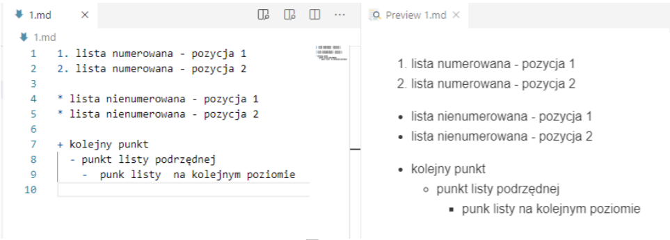    

Listy numerowane definiujemy wstawiając numery kolejnych pozycji zakończone kropką.

Listy nienumerowane definiujemy znakami: *,+,-

### Wyróżnianie tekstu

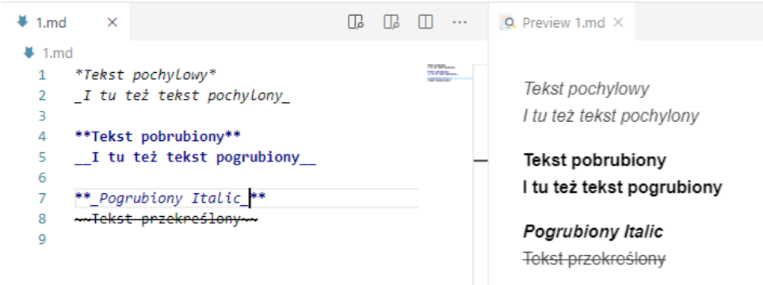 

### Tabele

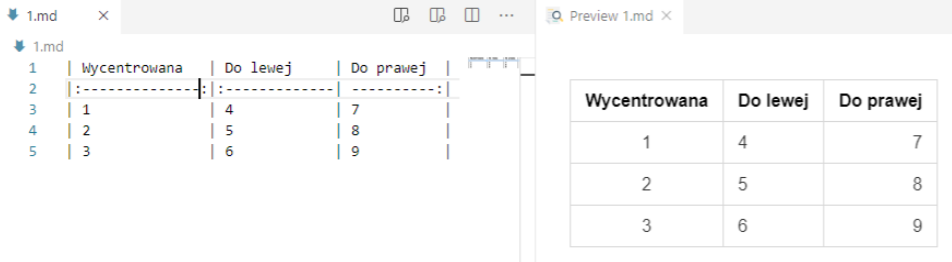

Centrowanie zawartości kolumn realizowane jest poprzez odpowiednie użycie znaku dwukropka:

### Odnośniki do zasobów

[odnośnik do zasobów](www.gazeta.pl)

[odnośnik do pliku](LICENSE.md)

[odnośnik do kolejnego zasobu][1]

[1]: [http://google,com](http://google,com)

**Obrazki**

 – obrazek z zasobów
internetowych  

 – obraz z lokalnych zasobów  

### Kod źródłowy dla różnych języków programowania  

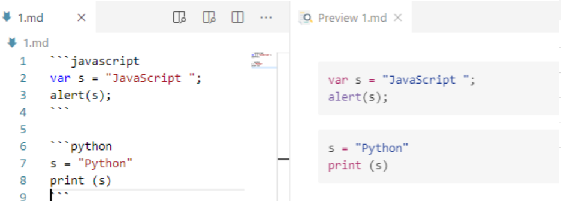

### Tworzenie spisu treści na podstawie nagłówków  

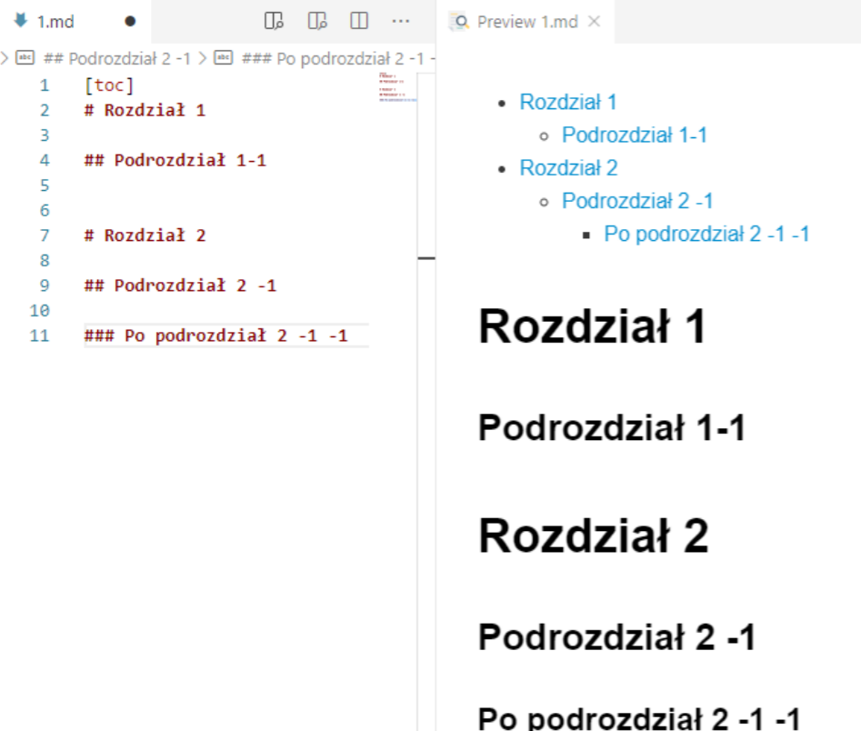

## Edytory dedykowane

Pracę nad dokumentami w formacie Markdown( rozszerzenie md) można wykonywać w
dowolnym edytorze tekstowym. Aczkolwiek istnieje wiele dedykowanych narzędzi

1. Edytor Typora - https://typora.io/
2. Visual Studio Code z wtyczką „markdown preview”

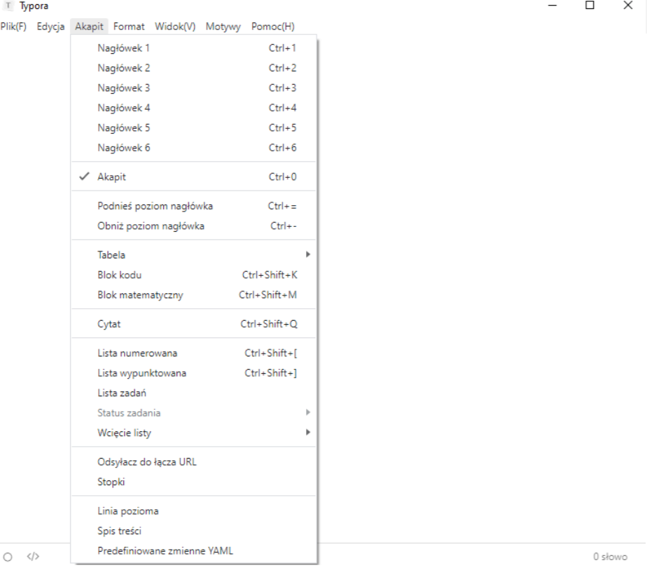

## Pandoc – system do konwersji dokumentów Markdown do

## innych formatów

Jest oprogramowanie typu open source służące do konwertowania dokumentów
pomiędzy różnymi formatami.

Pod poniższym linkiem można obejrzeć przykłady użycia:

https://pandoc.org/demos.html

Oprogramowanie to można pobrać z spod adresu: https://pandoc.org/installing.html

Jeżeli chcemy konwertować do formatu latex i pdf trzeba doinstalować oprogramowanie
składu Latex (np. Na windows najlepiej sprawdzi się Miktex https://miktex.org/)

Gdyby podczas konwersji do formatu pdf pojawił się komunikat o niemożliwości
znalezienia programu pdflatex rozwiązaniem jest wskazanie w zmiennej środowiskowej
PATH miejsca jego położenia

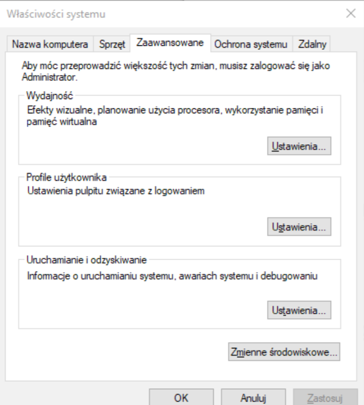

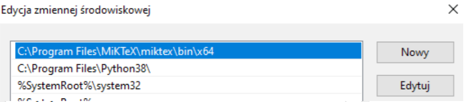

Pod adresem (https://gitlab.com/mniewins66/templatemn.git) znajduje się przykładowy plik
Markdown z którego można wygenerować prezentację w formacie pdf wykorzystując
klasę latexa beamer.

W tym celu należy wydać polecenie z poziomu terminala:

$pandoc templateMN.md -t beamer -o prezentacja.pdf
